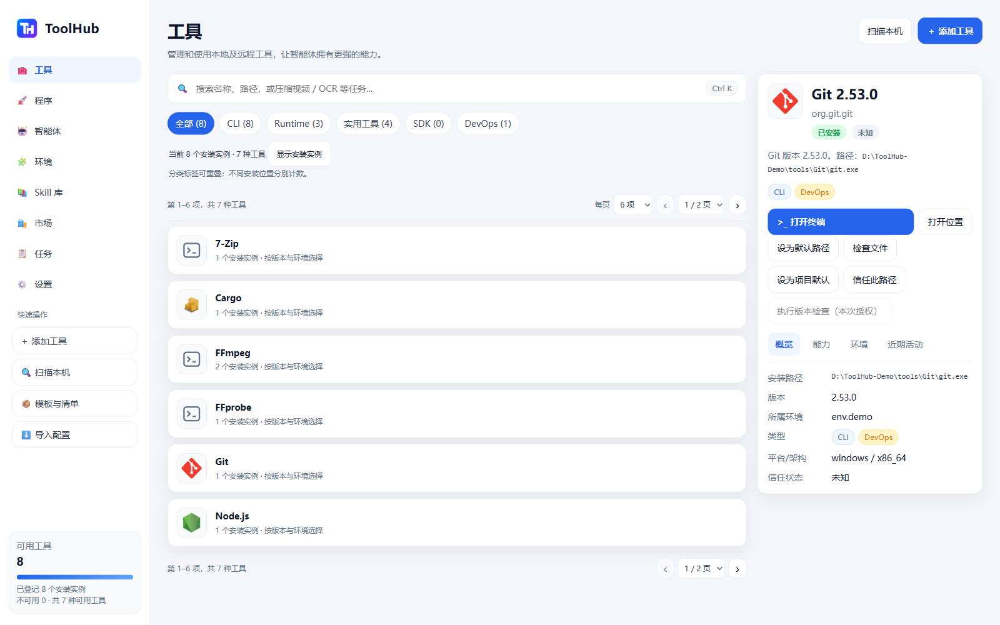
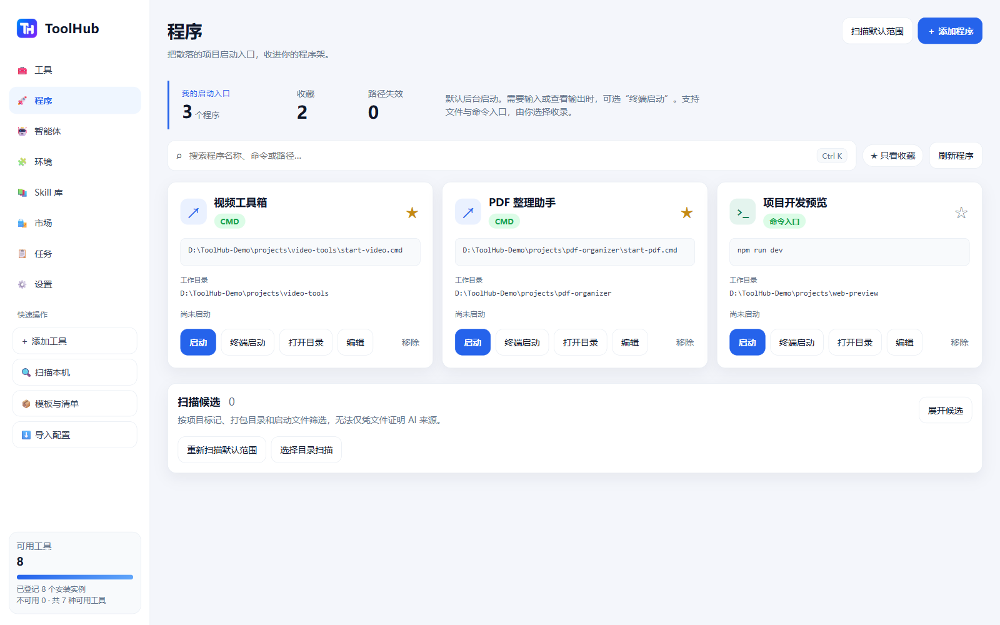
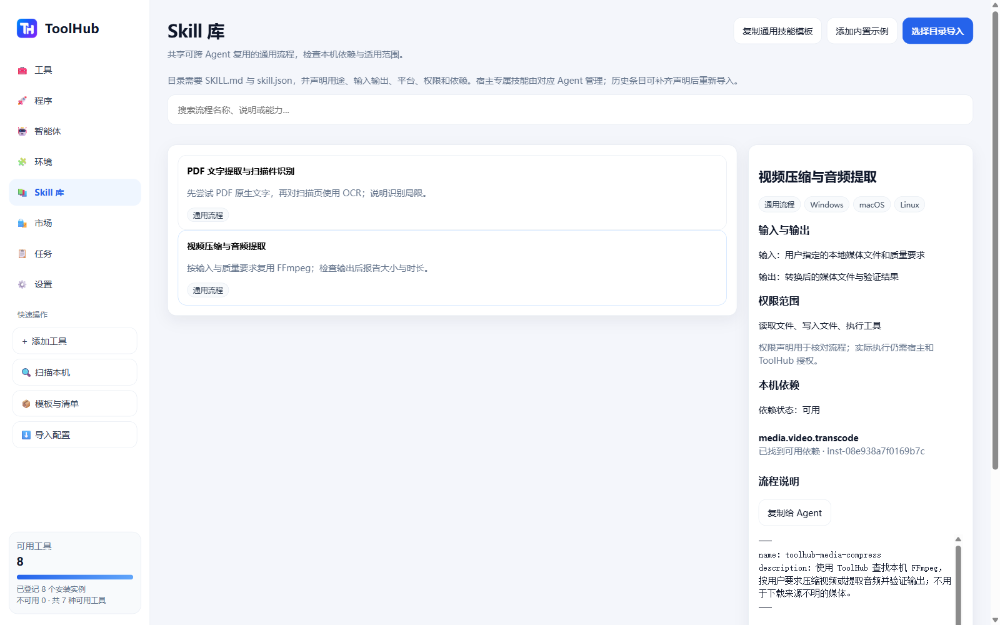
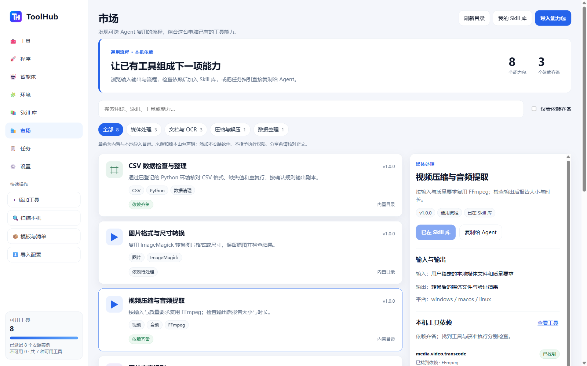

<div align="center">
  
  <h1>ToolHub</h1>
  <p><strong>让 Agent 先找到本机已有的工具，再开始工作。</strong></p>
  <p>A local tool hub for people and AI agents. Discover, resolve and reuse what's already on your machine.</p>
  <p>
    <a href="https://github.com/xiyuxiao1314/ToolHub/releases"></a>
    <a href="LICENSE"></a>
    
    
  </p>
  <p><strong>简体中文</strong> | <a href="README.en.md">English</a></p>
  <p><a href="https://github.com/xiyuxiao1314/ToolHub/releases/tag/v0.3.0-beta.1">下载 v0.3.0-beta.1</a> · <a href="#界面预览">界面预览</a> · <a href="#接入-ai-agent">Agent 接入</a> · <a href="#从源码构建">源码构建</a> · <a href="https://github.com/xiyuxiao1314/ToolHub/issues">反馈问题</a></p>
</div>

## 为什么做 ToolHub

当你让 Agent 压缩视频、处理 PDF 或运行一个项目时，它可能重新寻找 FFmpeg、安装 Python，或者留下一个散落在项目目录中的启动脚本。工具越多、Agent 越多，本机已经具备的能力反而越难被看见。

ToolHub 把本机工具整理成可查询的目录：在哪里、版本是什么、属于哪个环境、提供什么能力、当前是否可用。人通过桌面界面查看和管理，Agent 通过本地 MCP 或 CLI 查询。你创建的应用可以进入“程序架”，通用的工作方法可以保存为 Skill，能力包则把流程说明和工具依赖一起分享。

ToolHub 使用已有工具，工具发现不依赖 AI 服务；它不会自动下载 FFmpeg、安装语言环境或清理你的电脑。Agent 接入后需要遵循自己的任务指引，ToolHub 不能强制所有 Agent 改变工具选择习惯。

## 界面预览

以下截图来自 **v0.3.0-beta.1 Windows 发布版**，使用独立演示数据。当前桌面界面为简体中文；点击图片可查看原图。

### 工具总览

把多个安装实例按工具合并，通过分类、搜索和分页定位工具；右侧查看版本、路径、环境与信任状态。



### 程序架

集中管理文件和命令两种启动入口，保留工作目录，支持收藏、后台启动和打开目录。图中的项目入口为演示样例。



### 通用 Skill 库

查看可跨 Agent 复用的流程，核对输入输出、适用平台、权限声明与本机工具依赖，再复制给 Agent 使用。



### 能力包市场

浏览内置能力包，预览流程与依赖检查结果，确认后加入自己的 Skill 库，或复制、导出分享。



## 当前功能

| 模块 | 已实现的功能 |
| --- | --- |
| 工具 | 本机扫描、名称/路径/任务搜索、能力解析、版本与环境查看、可用性检查、默认路径选择 |
| 列表 | 按工具合并或显示安装实例，分类筛选，每页 6 / 12 / 24 项，分页和每页数量记忆 |
| 实用程序 | 识别 FFmpeg、FFprobe、7-Zip、ImageMagick、Pandoc、Tesseract、Poppler 等媒体、文档与自动化工具 |
| 程序架 | 文件或命令入口、工作目录、参数、收藏、后台启动、打开目录、失效路径提示 |
| Agent 提交 | 通过 MCP 提交新应用的启动入口，进入待确认列表，用户勾选并审核后收录 |
| 智能体 | 宿主检测、已配置连接和历史握手/调用记录，接入模板与 MCP 连接检查 |
| 环境 | 查看工具所属环境、重复安装和运行时；不自动删除或合并环境 |
| Skill 库 | 导入可复用的通用流程，检查平台、宿主依赖和本机工具依赖；通过 MCP 查找与读取 |
| 市场 | 8 个随包附带的通用能力包，预览说明与依赖，明确确认后收录，导入与导出分享 |
| 任务与授权 | 受策略约束的工具执行、待审批请求、后台任务状态/取消、活动记录 |
| 设置 | 配置导入/导出、显示选项；Windows 当前用户的登录自启动设置与诊断 |

同一工具的不同安装路径分别计为安装实例；“CLI”“Runtime”等分类标签可以重叠，因此分类数量不能相加得到总数。

### Agent 的一次使用流程

```text
用户提出任务
    ↓
Agent 查询 ToolHub：本机已有工具 / 通用 Skill / 对应能力
    ↓
检查真实实例、路径、依赖和权限
    ↓
按策略执行；需要时提交桌面审批
    ↓
完成应用后，提交启动入口到“待确认”
    ↓
用户勾选、核对，再收录到程序架
```

### 通用 Skill 与市场

共享 Skill 是可以被不同 Agent 理解的流程说明，例如“使用已有 FFmpeg 压缩视频”，包含输入、输出、平台、工具依赖和权限声明。ToolHub 不会扫描并注册每个 Agent 的私有 Skill，也不会把某个宿主专属的图像生成、浏览器或插件 API 当作其他 Agent 都能使用的能力。

市场当前是随应用发布的本地能力包目录，可导入、预览、收录和分享 `.toolhub-skill.json`。内置包涉及媒体压缩/探测、音频提取、图片转换、PDF 文本/OCR、文档转换、归档解压和 CSV 数据检查。市场尚无在线社区索引、账号、付费内容或自动安装依赖。

## 下载与平台支持

首个开源预览版为 **v0.3.0-beta.1**。所有文件在 [GitHub Releases](https://github.com/xiyuxiao1314/ToolHub/releases/tag/v0.3.0-beta.1) 的 Assets 中下载。

| 你的系统 | 推荐下载 | 说明 |
| --- | --- | --- |
| Windows 10 / 11，64 位 | `ToolHub-v0.3.0-beta.1-windows-x64.zip` | 桌面、CLI、daemon 和能力包；本机原生验证 |
| Mac，Apple Silicon（M 系列） | `ToolHub-v0.3.0-beta.1-macos-arm64.dmg` | macOS 13+；预览支持，另附 ZIP |
| Mac，Intel | `ToolHub-v0.3.0-beta.1-macos-x64.dmg` | macOS 13+；预览支持，另附 ZIP |
| 只需 CLI / MCP 服务 | `ToolHub-CLI-v0.3.0-beta.1-<平台>.zip` | 包含 CLI 和配对 daemon，不含桌面审批界面 |
| 校验文件 | `SHA256SUMS.txt` | 对照 SHA-256 检查下载文件完整性 |

Windows 与 macOS 共用代码、数据模型和 MCP 接口，部分桌面能力仍有平台差异：

| 能力 | Windows | macOS |
| --- | --- | --- |
| 工具发现、注册、能力解析、CLI / MCP | 支持 | 支持；以 CI 原生构建与测试为依据 |
| 桌面列表、通用 Skill、能力包市场 | 支持 | 预览支持 |
| 原生文件/目录选择、能力包保存 | 支持 | 原生 AppleScript 对话框 |
| 程序后台启动 | `.exe/.bat/.cmd/.lnk/.ps1` 和 CMD 命令 | 可执行文件、`.sh/.command` 和 sh 命令；`.app` 整体入口暂不支持 |
| 在工具目录打开终端 | CMD | Terminal；系统可能要求允许自动化控制 Terminal |
| 程序“终端启动” | 支持 | 暂不支持；可后台启动或自行在终端运行 |
| 受控工具执行 / 执行审批（CLI、MCP） | 支持 | 暂不支持；身份绑定启动未实现，不降级为普通路径执行 |
| 登录自启动、原生 EXE 图标提取 | 支持 | 暂不支持 |
| 项目程序默认扫描范围 | 本地固定/可移动磁盘，过滤系统与依赖目录 | 用户主目录；可显式选择项目目录 |

macOS 可查询工具、Skill 与能力包并使用程序架；`execute_tool` 和执行审批明确返回不可用，不会绕过可执行文件身份校验。Agent 如需直接调用查询到的工具，仍须遵守自身宿主的执行权限。

macOS 包由 GitHub 的 macOS 环境生成；发布时记录构建与测试结果。尚无实体 Mac 上的完整交互验收。Linux、Windows ARM64、移动端暂不提供发布包。

### Windows 使用

1. 下载桌面 ZIP，解压到一个准备长期保留的位置。
2. 双击 `toolhub-desktop.exe`。请保留同目录的 `toolhubd.exe`、`toolhub.exe`、`skills` 等文件。
3. 打开“工具”，点击“扫描本机”。扫描是只读发现，未知程序不会被自动执行版本检查。
4. 需要收录项目启动方式时，在“程序”中选择文件/工作目录，或扫描候选后勾选保存。

需要桌面快捷方式和版本化安装时，可以用 **PowerShell 7** 在解压目录执行：

```powershell
./install-local.ps1 -VerifyOnly
./install-local.ps1
```

安装到当前用户的 `%LOCALAPPDATA%\ToolHub\versions`，保留已有用户数据。登录自启动需要在设置中主动开启；安装脚本只迁移已经存在的 ToolHub 登录任务。它不会自动配置所有 Agent。可选 `-UpdateCodexMcp` 只用于明确更新现有 Codex 的 ToolHub MCP 项。

Windows 需要 Microsoft Edge WebView2 Runtime。通常系统已安装；缺失时使用 [微软官方 WebView2 下载页](https://developer.microsoft.com/en-us/microsoft-edge/webview2/)。本预览版 Windows 可执行文件未购买代码签名证书，可能出现系统发布者提示，请核对来源与校验值。

### macOS 使用

1. 按芯片选择 DMG，打开后把 `ToolHub.app` 拖到 Applications。
2. 启动 ToolHub；CLI 位于 `/Applications/ToolHub.app/Contents/MacOS/toolhub`。
3. 配置 MCP 时使用该 CLI 的绝对路径。移动应用后需要更新宿主中的路径并重载连接。

应用使用 ad-hoc 签名，**没有 Apple Developer 签名与公证**。若系统阻止打开，请核对官方 Release 和 SHA-256，再通过系统“隐私与安全性”中的允许打开流程处理；不需要关闭系统整体安全检查。

## 接入 AI Agent

ToolHub 提供 **本地 stdio MCP**，任何实现兼容 MCP 的客户端都可以接入。已提供 Codex、MiMo / OpenCode、Claude Code / Desktop、Cursor、Gemini CLI、Copilot、VS Code 等宿主模板。模板和检测只代表配置适配，不能证明某个宿主已成功调用；以连接测试与实际工具调用为准。

最方便的方式：打开“智能体 → 接入说明”，复制当前安装的连接信息和接入任务指引给 Agent。指引会要求保留其他宿主配置、使用正确的 CLI 路径、检查握手和工具列表。

### 常见 JSON 格式

将下列内容合并到宿主配置中，替换路径；不同客户端的配置文件位置与启用方式以客户端文档为准。

```json
{
  "mcpServers": {
    "toolhub": {
      "command": "C:\\Tools\\ToolHub\\toolhub.exe",
      "args": ["mcp", "serve"]
    }
  }
}
```

macOS 的 command 改为 `/Applications/ToolHub.app/Contents/MacOS/toolhub`。CLI 和 daemon 必须保持配对。桌面用户应配置桌面包里的 CLI；不要同时用另一个目录的 CLI-only 包启动同一用户服务，服务会检查配对 daemon 的路径与身份。Agent 的只读查询不要求桌面窗口一直打开，交互审批则需要桌面。

### Codex TOML

```toml
[mcp_servers.toolhub]
command = 'C:\Tools\ToolHub\toolhub.exe'
args = ["mcp", "serve"]
```

### MiMo / OpenCode JSONC

它们使用本地 `command` 数组，不是上面的 command / args 分离格式：

```json
{
  "mcp": {
    "toolhub": {
      "type": "local",
      "command": ["C:\\Tools\\ToolHub\\toolhub.exe", "mcp", "serve"],
      "enabled": true
    }
  }
}
```

VS Code 使用 `servers` 结构；桌面接入说明内有对应模板。配置后重载 MCP 连接或开启新会话。

### 接入 Skill

[toolhub-integration/SKILL.md](skills/toolhub-integration/SKILL.md) 是通用接入指引。支持 Skill 的宿主可把它安装在自己的 Skill 目录，不支持 Skill 的宿主可把它作为任务指引。填写本机安装路径后，要求 Agent：先搜索工具或解析能力，检查实例，再按权限使用；完成应用后提交待确认入口。

网关公开 12 个固定元工具，避免把每个软件都展开成一个 MCP 工具：

| 用途 | MCP 工具 |
| --- | --- |
| 发现与检查 | `search_tools`、`resolve_capability`、`inspect_tool`、`list_environments` |
| 执行与审批 | `execute_tool`、`request_execution_approval` |
| 后台任务 | `get_task`、`cancel_task` |
| 通用 Skill | `search_skills`、`inspect_skill` |
| 项目应用 | `propose_program`、`search_programs` |

宿主名称与历史记录用于显示，不能授予执行权限。`propose_program` 只提交声明，不会保存、启动或信任该程序；共享给 Agent 的程序信息也不等于执行授权。

## CLI 示例

Windows PowerShell：

```powershell
$toolhubPath = 'C:\Tools\ToolHub\toolhub.exe'
& $toolhubPath --version
& $toolhubPath --json status
& $toolhubPath --json scan --mode quick
& $toolhubPath --json search ffmpeg
& $toolhubPath --json resolve media.video.transcode
& $toolhubPath --json env list
& $toolhubPath --json skill list
& $toolhubPath doctor
```

macOS Terminal：

```sh
toolhub_bin='/Applications/ToolHub.app/Contents/MacOS/toolhub'
"$toolhub_bin" --json status
"$toolhub_bin" --json search ffmpeg
"$toolhub_bin" --json resolve media.video.transcode
"$toolhub_bin" mcp serve
```

实例 ID 来自查询结果。执行受策略、工作目录、实例完整性与必要的用户审批约束；`--json` 便于 Agent 解析。完整参数查看 `toolhub --help` 和各子命令 `--help`。

## 本机数据与安全边界

- 注册表、程序入口、Skill 元数据默认保存在用户目录 `~/.toolhub/registry.sqlite`，能力包缓存也保存在该数据目录下。删除应用不等于删除用户数据。
- 扫描不自动安装、删除、修改 PATH 或提升权限。未知可执行文件不会为了“识别版本”被自动运行。
- 文件选择/候选勾选发生在编辑与收录之前。扫描依据项目标记和入口形态，**不能仅凭文件证明它由 AI 创建**。
- 工具执行采用本地连接身份验证、实例检查、策略和绑定到具体调用的一次性审批；发现工具、导入 Skill 或声明权限都不自动授权执行。
- 子进程使用清理后的环境；ToolHub 的权限约束覆盖自己的接口，不能替代 Agent 宿主自己的 shell 权限或操作系统沙箱。
- Skill 和外部能力包是未受信任的说明文本，导入不执行安装钩子。通用性检查依据声明和已知宿主引用，不能证明任意文本安全或完全可移植。
- 数据以本机为中心；可选 AI 辅助流程与用户主动导出有独立边界。分享前检查待导出的内容。

更多实现约束见 [SECURITY.md](SECURITY.md)。请勿把自己的注册表数据库、Agent 配置、API Key 或日志作为源码上传。

## 从源码构建

技术栈：Rust / Tokio / SQLite 核心，Tauri 2 桌面，React / TypeScript 前端，独立 stdio MCP 网关与 TypeScript SDK。

要求：Rust 1.90+（推荐当前 stable）、Node.js 22+、对应平台的原生开发工具。Windows 安装 Visual Studio C++ Build Tools 和 WebView2；macOS 安装 Xcode Command Line Tools。详见 [Tauri 官方前置条件](https://v2.tauri.app/start/prerequisites/)。

```sh
git clone https://github.com/xiyuxiao1314/ToolHub.git
cd ToolHub
npm ci --prefix apps/desktop/ui
npm run build --prefix apps/desktop/ui
cargo build --release -p toolhub-cli -p toolhub-daemon -p toolhub-desktop --locked
```

Windows 产物为 `target/release/toolhub-desktop.exe`、`toolhubd.exe`、`toolhub.exe`；macOS 省略 `.exe`。

验证与打包：

```sh
cargo test --release --workspace --locked -- --test-threads=1
node --test packages/sdk-typescript/test/client.test.js
python scripts/package-release.py --platform windows-x64
# 在对应架构的 Mac 上：--platform macos-arm64 或 --platform macos-x64
```

打包脚本要求 Python 3.11+，使用已生成的原生二进制，输出到 `dist/release/<平台>`，不修改用户配置。每次使用空的输出目录；macOS 包必须在 macOS 上生成。GitHub Actions 自动执行三种原生平台构建、测试与资产上传，见 [发布工作流](.github/workflows/release.yml)。

### 代码结构

```text
apps/daemon/          本机服务、策略执行、任务与程序入口
apps/cli/             CLI 与 MCP stdio 入口
apps/desktop/         Tauri 桌面和 React UI
crates/               领域模型、扫描识别、注册表、解析、IPC、MCP、Skill 等
packages/sdk-typescript/  TypeScript 客户端
skills/               接入 Skill、通用 Skill 示例、市场能力包
schemas/              可交换格式的 JSON Schema
scripts/              本机安装、验证、原生发布打包
docs/                 系统设计、实现说明、历史开发与验证记录
```

[系统设计](docs/design/TOOLHUB_SYSTEM_DESIGN.md) 描述完整产品方向，其中部分目标尚未实现；当前功能以本 README 与 [版本说明](docs/releases/v0.3.0-beta.1.md) 为准。

## 已知限制与后续方向

这是 beta 预览版，跨宿主实际兼容性和 macOS 桌面交互仍需更多用户反馈。没有自动更新、在线能力包索引或已签名的安装程序；不会自动解决缺失依赖。宿主检测只读取已知用户配置位置，项目覆盖、远程 MCP 和自定义路径可能需要手动确认。

后续重点是 macOS 交互验收与功能对齐、发布签名、更明确的工具能力与依赖诊断、能力包版本与来源管理。欢迎贡献更多本机工具识别规则、可复用 Skill 和真实宿主兼容性结果。

## 参与贡献

请提交 [Issue](https://github.com/xiyuxiao1314/ToolHub/issues) 或 Pull Request。Bug 报告请附版本、系统/架构、复现步骤、预期与实际行为；先移除账号、令牌、私人文件路径和敏感输出。改动保持领域模型集中、发现只读和审批边界不变，并补充与行为相关的测试。

## 许可证

ToolHub 源码以 [MIT License](LICENSE) 开源。第三方依赖保持各自许可证；ToolHub 发布包不附带 FFmpeg、Python、Node.js 等被发现的软件，也不授予它们的再分发权。品牌资源和第三方依赖说明见 [NOTICE](NOTICE)。
